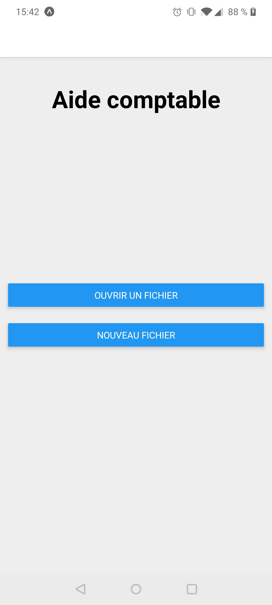
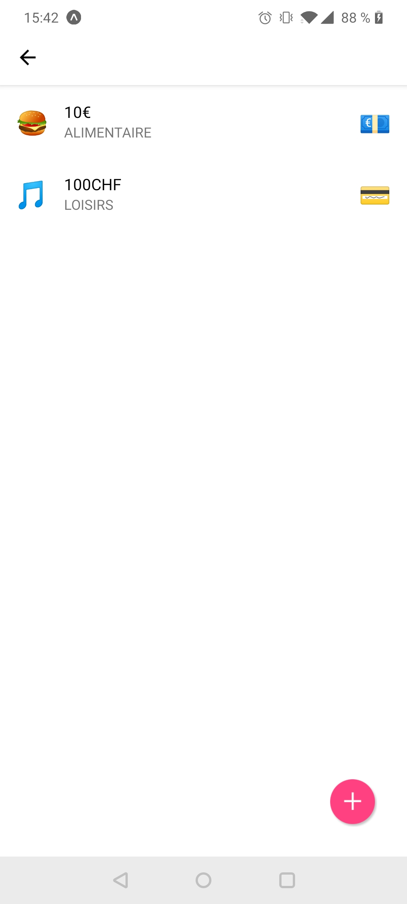
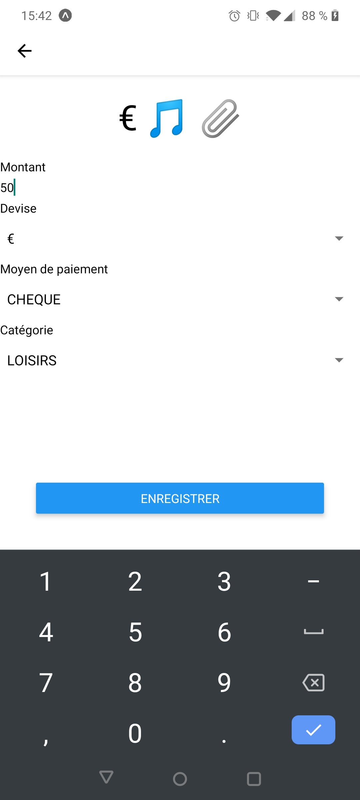
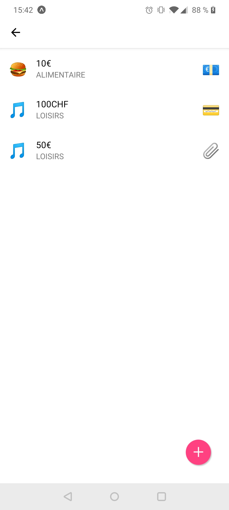
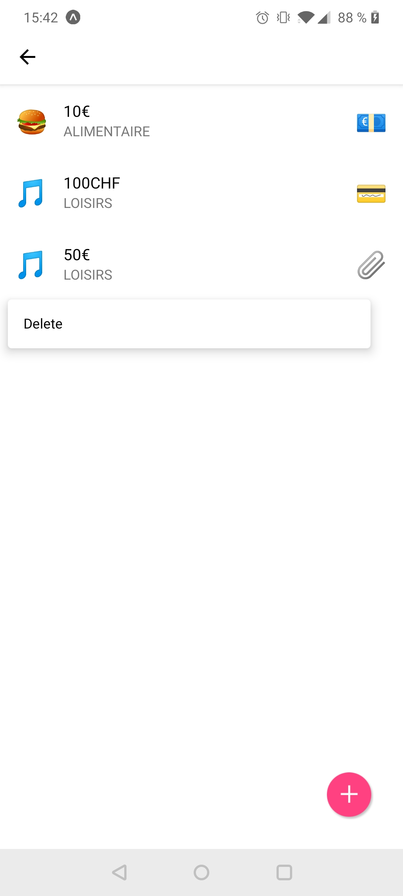

# Accounting app

![Build Status][build-action-image]


## Use

``` bash
npm install --dev
yarn install
expo start
```

## Screenshots






[build-action-image]: https://github.com/intv0id/ReactNativeSnippet/workflows/Expo%20Build/badge.svg